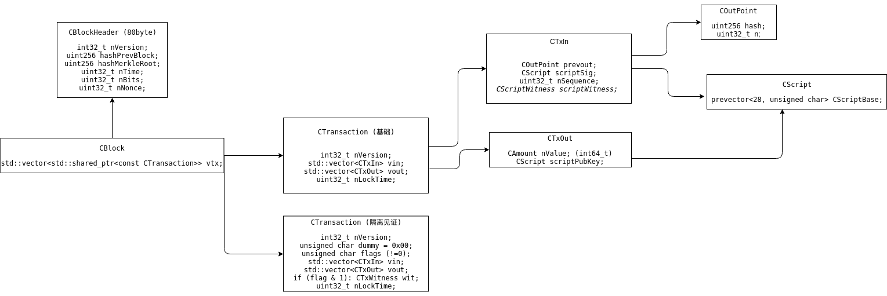

<!-- TOC -->

- [1. 资源](#1-资源)
- [2. 问题积累](#2-问题积累)
- [3. 钱包提议](#3-钱包提议)
- [4. block/transaction](#4-blocktransaction)
- [5. merkle tree spv轻量钱包验证](#5-merkle-tree-spv轻量钱包验证)
- [6. 硬分叉 软分叉](#6-硬分叉-软分叉)
- [7. P2K P2PKH P2WPKH P2SH P2WSH ...](#7-p2k-p2pkh-p2wpkh-p2sh-p2wsh-)

<!-- /TOC -->

<a id="markdown-1-资源" name="1-资源"></a>
# 1. 资源


* https://bitcoin.org/en/developer-documentation (教程列表)
* https://bitcoin.org/en/developer-guide
* https://bitcoin.org/en/developer-reference
* https://bitcoin.org/en/developer-examples
* https://bitcoincore.org/en/doc/0.16.3/ (rpc接口说明)
* http://chainquery.com/bitcoin-api/getblockchaininfo (rpc接口测试网页)
* https://live.blockcypher.com/btc-testnet/decodetx/ (decode transaction)
* https://github.com/bitcoin/bips (bip 列表)

---

钱包:
* https://bitcoin.org/en/wallets/mobile/android/bitcoinwallet/

浏览器:
* https://www.blockchain.com/zh-cn/explorer
* https://github.com/bitpay/insight

---

* https://github.com/liuchengxu/blockchain-tutorial/blob/master/content/SUMMARY.md (很好的中文资料)
* https://www.zhihu.com/question/27687960/answer/148814714 (知乎资料索引)
* https://github.com/chaozh/awesome-blockchain-cn (所有资料)
* https://bbs.huaweicloud.com/community/usersnew/id_1518334573351109 (讲比特币的专栏)
* http://book.8btc.com/books/6/masterbitcoin2cn/_book/ (精通比特币书)


<a id="markdown-2-问题积累" name="2-问题积累"></a>
# 2. 问题积累

> 比特币的根本技术是什么?


* `POW` 工作量证明的共识达成机制是Adma在Hashcash里提出来的
* 将`全部交易计入一本总账`,并给交易打时间戳来`防范双花攻击`(double-spend attack)的思想是的 b-money 和 Nick Szabo 的 Bitgold 提出来的
* P2P技术比不上2001年出现的BitTorrent

中本聪自创的
* 区块链的设计 + UTXO `Unspent Transaction Output`


> 比特币交易速度每秒7笔怎么算出来的?

* https://www.zhihu.com/question/41004649/answer/145731141

---
* 定义每一个区块的一个账册的大小是1MiB
* 每10分钟产生一个这样的区块
* 每个最基本的比特交易的大小是250B

```
1MiB = 1024 * 1024 B = 1048576 B

1048576 / 250 = 4194 (个)  -- 一个区块可有4194个比特币的转账记录

4194 / 600 ≈ 7 (个/s) -- 大约7秒钟能交易一个比特币
```

> 比特币一笔交易的占用大小是多少?

> 比特币当前的区块容量是多少? 

> 比特币当前的区块头占用空间是多少?

> 比特币当前的全量区块占用空间是多少?

> 2100万是否真能挖完

> timestamp为uint32_t 未来有什么危机?

> 比特币是否宕机过?

> 比特币的问题?

* 算力集中化
* 私钥丢失
* 隐私
* public key 量子攻击
* 粉尘攻击

<a id="markdown-3-钱包提议" name="3-钱包提议"></a>
# 3. 钱包提议

* `BIP32 (HD钱包)` http://bip32.org/ (以特定规则生成私钥,只需要存储少量的种子,就能推算出无数个可用的私钥)
* BIP38 (纸钱包) https://bitcoinpaperwallet.com/bip38-password-encrypted-wallets/
* `BIP39 (助记码)` https://iancoleman.io/bip39/ (用有意义的助记词代替无意义的数字)
* `BIP43 (多用途HD钱包结构)` (提出了BIP32的规范)
* `BIP44` https://github.com/bitcoin/bips/blob/master/bip-0044.mediawiki (BIP43的特殊的应用)
* BIP49 (P2WPKH-nested-in-P2SH) https://github.com/bitcoin/bips/blob/master/bip-0049.mediawiki


BIP32  


BIP39  


<a id="markdown-4-blocktransaction" name="4-blocktransaction"></a>
# 4. block/transaction




<a id="markdown-5-merkle-tree-spv轻量钱包验证" name="5-merkle-tree-spv轻量钱包验证"></a>
# 5. merkle tree spv轻量钱包验证


比特币验证分为:

* 支付验证: 非常复杂 1. 余额是否可供支出 2. 是否存在双花 3. 脚本是否能通过
* 交易验证: 只判断支付的交易是否已经被验证过

验证一笔交易时只需要验证:

* 交易hash
* 树根hash
* merkle path(我理解为关键branch的hash)


相关资料:

* https://en.wikipedia.org/wiki/Merkle_tree (wiki)
* https://media.consensys.net/ever-wonder-how-merkle-trees-work-c2f8b7100ed3 (香蕉演示)
* https://github.com/richpl/merkletree (java-验证特性呢?)
* https://github.com/c-geek/merkle (js-验证特性呢?)


问题, merkle path在验证时怎么得到?

* https://bitcoin.stackexchange.com/questions/50674/why-is-the-full-merkle-path-needed-to-verify-a-transaction/50680(提问)

>> In order to verify that a transaction is included in a block, without having to download all the transactions in the block, they use an authentication path, or a merkle path. 

参考
* https://bitcoin.org/en/developer-reference#merkleblock

>>搜索　MSG_MERKLEBLOCK　

<a id="markdown-6-硬分叉-软分叉" name="6-硬分叉-软分叉"></a>
# 6. 硬分叉 软分叉

* https://bitcoin.org/en/glossary/hard-fork
* https://bitcoin.org/en/glossary/soft-fork


<a id="markdown-7-p2k-p2pkh-p2wpkh-p2sh-p2wsh-" name="7-p2k-p2pkh-p2wpkh-p2sh-p2wsh-"></a>
# 7. P2K P2PKH P2WPKH P2SH P2WSH ...

* https://en.bitcoin.it/wiki/Script (opcode)
* https://siminchen.github.io/bitcoinIDE/build/editor.html (脚本编辑调试)
* https://bitcoin-script-debugger.visvirial.com/ (常见交易种类)
* https://github.com/bitcoin/bitcoin/blob/v0.17.0/doc/descriptors.md (列表)

---
* scriptPubKey (加锁)
* scriptSig (解锁)

P2K

```bash
# scriptPubKey (prev out)
OP_CHECKSIG
<pubKey>

# scriptSig (in)
<sig>
```

P2PKH

```bash
# scriptPubKey (prev out)
OP_CHECKSIG
OP_EQUALVERIFY
<pubkeyHash>
OP_HASH160
OP_DUP

# scriptSig (in)
<pubKey>
<sig>
```

P2SH (BIP13 16)

```bash
# 单一签名
# scriptPubKey (prev out)
OP_EQUAL
[20-byte-hash of {[pubkey] OP_CHECKSIG} ]
OP_HASH160

# scriptSig (in)
{[pubkey] OP_CHECKSIG}
[signature]

# 3个签名
{2 [pubkey1] [pubkey2] [pubkey3] 3 OP_CHECKMULTISIG}
 
# 22个签名?
{OP_CHECKSIG OP_IF OP_CHECKSIGVERIFY OP_ELSE OP_CHECKMULTISIGVERIFY OP_ENDIF}
```

Multisig outputs (BIP 11)

```bash
# scriptPubKey (prev out)
OP_CHECKMULTISIG
n
{pubkey}...{pubkey}
m

# scriptSig (in)
...signatures...
OP_0
```

OP_RETURN (存数据)
```bash
# scriptPubKey (prev out)
<data2>
<data1>
OP_RETURN

# scriptSig (in)
# 空
```

Anyone-Can-Spend (不在p2p网络上传播)

```bash
OP_TRUE
```

Transaction Puzzle (猜谜吗)

```bash
# scriptPubKey (prev out)
OP_EQUAL
<given_hash>
OP_HASH256

# scriptSig (in)
<data> ?
```

Freezing funds until a time in the future (锁定一段时间)

```bash
# scriptPubKey (prev out)
OP_CHECKSIG
OP_EQUALVERIFY
<pubKeyHash>
OP_HASH160
OP_DUP
OP_DROP
OP_CHECKLOCKTIMEVERIFY
<expiry time>

# scriptSig (in)
<pubKey>
<sig>
```

Incentivized finding of hash collisions

```bash
# scriptPubKey (prev out)
OP_EQUAL
OP_SHA1
OP_SWAP
OP_SHA1
OP_VERIFY
OP_NOT
OP_EQUAL
OP_2DUP

# scriptSig (in)
<preimage2>
<preimage1>
```
