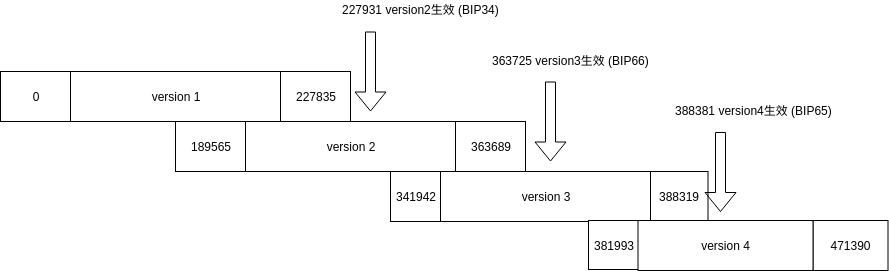
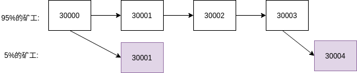

<!-- TOC -->

- [1. 说明](#1-说明)
- [2. 早期版本升级](#2-早期版本升级)
    - [2.1. BIP34](#21-bip34)
    - [2.2. BIP66](#22-bip66)
    - [2.3. BIP65](#23-bip65)
    - [2.4. 总结](#24-总结)
- [3. 新升级方式BIP-9](#3-新升级方式bip-9)
- [4. 参考资料](#4-参考资料)

<!-- /TOC -->


<a id="markdown-1-说明" name="1-说明"></a>
# 1. 说明


```c++
CBlockHeader

int32_t nVersion;
uint256 hashPrevBlock;
uint256 hashMerkleRoot;
uint32_t  nTime;
uint32_t nBits;
uint32_t nNonce;
```

<a id="markdown-2-早期版本升级" name="2-早期版本升级"></a>
# 2. 早期版本升级

通过之前的<区块的存储>文章介绍的知识,下载一份比特币的全量数据,编写脚本来得知区块版本的迁移,数据如下:

```bash
version: 1 num: 215047 firstHeight:       0 lastHeight:  227835 
version: 2 num: 140752 firstHeight:  189565 lastHeight:  363689 (BIP34) 生效高度: 227931
version: 3 num:  29304 firstHeight:  341942 lastHeight:  388319 (BIP66) 生效高度: 363725
version: 4 num:  27212 firstHeight:  381993 lastHeight:  471390 (BIP65) 生效高度: 388381
```

根据代码得知不同的版本对应着不同的BIP协议:

```bash
UniValue SoftForkMajorityDesc
```

* version 1: 原始的区块版本
* version 2: BIP34
* version 3: BIP66
* version 4: BIP65





<a id="markdown-21-bip34" name="21-bip34"></a>
## 2.1. BIP34


`升级的目的,关键代码:`

```c++
// ContextualCheckBlock <- CChainState::AcceptBlock <- ProcessNewBlock <- ProcessMessage(3 usages)

if (nHeight >= consensusParams.BIP34Height)
{
    CScript expect = CScript() << nHeight;
    if (block.vtx[0]->vin[0].scriptSig.size() < expect.size() ||
        !std::equal(expect.begin(), expect.end(), block.vtx[0]->vin[0].scriptSig.begin())) {
        return state.DoS(100, false, REJECT_INVALID, "bad-cb-height", false, "block height mismatch in coinbase");
    }
}
```

分析以上代码得知,在当达到BIP34的版本的高度的时候,会强制检查区块的高度,`在coinbase的见证脚本中必须有高度的信息.`


`升级的过程,概述`:

* 75%规则: 如果最后1000个区块的750个是版本2或更高,则`A.版本2在coinbase中必须包含块高度`, `B.版本1仍被网络接受`. 此时新旧版本规则共存
* 95%规则: 如果最后1000个区块的950个是版本2或更高,则 `版本1不再视为有效`


<a id="markdown-22-bip66" name="22-bip66"></a>
## 2.2. BIP66

`升级的目的,关键代码:`

```bash
# GetBlockScriptFlags <- CChainState::ConnectBlock <- CChainState::ConnectTip <- CChainState::ActivateBestChainStep <- CChainState::ActivateBestChain <- ProcessNewBlock <- ProcessMessage(3 usages)

# 给区块的flag置上检查位
if (pindex->nHeight >= consensusparams.BIP66Height) {
    flags |= SCRIPT_VERIFY_DERSIG;
}

# CheckSignatureEncoding <- EvalScript(2 usages) <- VerifyScript(3 usages)
# 检查签名的格式,符合DER编码
if ((flags & (SCRIPT_VERIFY_DERSIG | SCRIPT_VERIFY_LOW_S | SCRIPT_VERIFY_STRICTENC)) != 0 && !IsValidSignatureEncoding(vchSig)) {
    return set_error(serror, SCRIPT_ERR_SIG_DER);
```

BIP66沿用BIP34的升级规则.

分析以上代码得知,在达到BIP66的版本的高度的时候,会检查签名是否符合DER编码的规则.


<a id="markdown-23-bip65" name="23-bip65"></a>
## 2.3. BIP65

`升级的目的,关键代码:`

```bash
# GetBlockScriptFlags <- CChainState::ConnectBlock <- CChainState::ConnectTip <- CChainState::ActivateBestChainStep <- CChainState::ActivateBestChain <- ProcessNewBlock <- ProcessMessage(3 usages)

# 给区块的flag置上检查位
if (pindex->nHeight >= consensusparams.BIP65Height) {
    flags |= SCRIPT_VERIFY_CHECKLOCKTIMEVERIFY;
}

# EvalScript <- VerifyScript(3 usages)
# 开启OP_CHECKLOCKTIMEVERIFY
case OP_CHECKLOCKTIMEVERIFY:
{
    if (!(flags & SCRIPT_VERIFY_CHECKLOCKTIMEVERIFY)) {
        // not enabled; treat as a NOP2
        break;
    }
```

BIP65沿用BIP34的升级规则.

分析以上代码得知,在达到BIP65版本的高度的时候,使得`SCRIPT_VERIFY_CHECKLOCKTIMEVERIFY`生效,支持`OP_CHECKLOCKTIMEVERIFY`指令. 简称`CLTV`.

<a id="markdown-24-总结" name="24-总结"></a>
## 2.4. 总结

区块链的本意是`尊重用户的利益`.因为共识软件的升级可能会损失部分用户的利益,所以当部分用户认为升级的利益的损失或升级带来的风险不能在接受范围之内时,用户可以选择不升级.

BIP34,66,65的升级方式可以概括为3个阶段:

* 阶段一: 同意比例达到[0,0.75)阶段. `"混乱"阶段"`,版本共存,并且新版本号码产生的区块可能不符合新版本的规则.
* 阶段二: 同意比例达到[0.75,0.95)阶段. `"共存阶段"`,版本共存,并且新版本号码产生的区块必须符合新版本的规则.
* 阶段三: 同意比例达到[0.95,1]阶段. `"升级完成阶段"`,必须是新版本,且符合新版本的规则.

`我们思考一个分叉的问题:`



当处于阶段三时,部分矿工由于没有及时升级到新版本,或者不愿意升级到新版本(参考BIP65升级过程).会产生孤块的情况,


<a id="markdown-3-新升级方式bip-9" name="3-新升级方式bip-9"></a>
# 3. 新升级方式BIP-9

旧式升级方式在升级了3个版本(nVersion=2,3,4)之后就被替换了

<a id="markdown-4-参考资料" name="4-参考资料"></a>
# 4. 参考资料

* https://github.com/bitcoin/bips/blob/master/bip-0034.mediawiki (BIP34)
* https://github.com/bitcoin/bips/blob/master/bip-0066.mediawiki (BIP66)
* https://github.com/bitcoin/bips/blob/master/bip-0065.mediawiki (BIP65)
* https://en.bitcoin.it/wiki/Softfork (BIP65升级过程中的问题)
* https://github.com/bitcoin/bips/blob/master/bip-0009.mediawiki (BIP9)
* https://bitcoincore.org/en/2016/06/08/version-bits-miners-faq/#when-should-miners-set-bits (BI9-官方文档)
