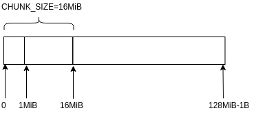

<!-- TOC -->

- [1. 说明](#1-说明)
- [2. 区块的存储](#2-区块的存储)
- [3. 使用python读取区块数据](#3-使用python读取区块数据)
- [4. 参考资料](#4-参考资料)

<!-- /TOC -->


<a id="markdown-1-说明" name="1-说明"></a>
# 1. 说明

比特币的特点:所有信息公开透明.通过写代码来浏览比特币的存储数据得知所有的区块信息,交易信息.可以做一些非常有趣的事情. 例如: 所有的转账记录 => 画成图 => 分析交易信息, 区块的版本信息 => 得知区块链版本的变迁

<a id="markdown-2-区块的存储" name="2-区块的存储"></a>
# 2. 区块的存储

重要的几个数据存储文件如下`(下文着重讲述高亮的2处文件)`:

* `blocks/blkxxxxx.dat (block data)`
* blocks/revxxxxx.dat (block undo data)
* `blocks/index/* block index (leveldb) `
* chainstate/* block chain state database (leveldb)

`打开文件处代码,可以通过这个回溯到相关读写处:`
```c++
// blocks/blkxxxxx.dat 
FILE* OpenBlockFile(const CDiskBlockPos &pos, bool fReadOnly) {
    return OpenDiskFile(pos, "blk", fReadOnly);
}

// blocks/index/*
CBlockTreeDB::CBlockTreeDB(size_t nCacheSize, bool fMemory, bool fWipe) : CDBWrapper(gArgs.IsArgSet("-blocksdir") ? GetDataDir() / "blocks" / "index" : GetBlocksDir() / "index", nCacheSize, fMemory, fWipe) {

leveldb::Status status = leveldb::DB::Open(options, path.string(), &pdb);
```

`核心存储区块的逻辑:`
```bash
SaveBlockToDisk

# 包括3步
# 1. GetSerializeSize 获取存储区块的大小
# 2. FindBlockPos 寻找到存储的位置,并分配好空间
# 3. WriteBlockToDisk 利用<序列化与反序列化>问中提到的技术,将区块写到磁盘上
```

文件的大小为128MiB,但是实际上不会存储满. 只会存储128MiB-1. (空间会分配满)



<a id="markdown-3-使用python读取区块数据" name="3-使用python读取区块数据"></a>
# 3. 使用python读取区块数据

摘要:

1) 字节序

* [u]int8_t
* [u]int16_t
* [u]int32_t
* [u]int64_t

以上类型都是以内存中的字节序序列化到磁盘上的,由于我们常用的是x86-64芯片,所以默认认为是`小端输出`

* uint256(base_blob<256>)

代码中以`uint8_t data[WIDTH];`,小端方式实现了大数字运算,所以默认是`小端输出`

2) varint

* 参考源码: https://github.com/bitcoin/bitcoin/blob/0.17/src/serialize.h#L253 
* 参考文档: https://bitcoin.org/en/developer-reference#compactsize-unsigned-integers
* 参考文档(建议): http://learnmeabitcoin.com/glossary/varint

在比特币中输出数组序列化对象时,会使用`varint`的技术,将数组的大小以不定长(1,3,5,9)的方式输出在数组前面.


辅助代码,从流中读取基础数据类型(小端)
```py
import struct
import sys


def peekuint1(stream):
    # bytes to int
    return ord(stream.peek(1)[:1])


def uint1(stream):
    # bytes to int
    return ord(stream.read(1))


def uint2(stream):
    return struct.unpack('H', stream.read(2))[0]


def uint4(stream):
    return struct.unpack('I', stream.read(4))[0]


def uint8(stream):
    return struct.unpack('Q', stream.read(8))[0]


def hash32(stream):
    # return bytes
    return stream.read(32)[::-1]


def time(stream):
    time = uint4(stream)
    return time


def varint(stream):
    size = uint1(stream)

    if size < 0xfd:
        return size
    if size == 0xfd:
        return uint2(stream)
    if size == 0xfe:
        return uint4(stream)
    if size == 0xff:
        return uint8(stream)
    return -1


def hashStr(bytebuffer):
    return ''.join(('%02x' % a) for a in bytebuffer)
```

序列化到结构体:
```py
class BlockHeader:
    def __init__(self, stream):
        self.nVersion = uint4(stream)
        self.hashPrevBlock = hash32(stream)
        self.hashMerkleRoot = hash32(stream)
        self.nTime = uint4(stream)
        self.nBits = uint4(stream)
        self.nNonce = uint4(stream)

    def __str__(self):
        str = "nVersion: 0x{0:x}\n".format(self.nVersion)
        str = str + "hashPrevBlock: {0}\n".format(hashStr(self.hashPrevBlock))
        str = str + "hashMerkleRoot: {0}\n".format(hashStr(self.hashMerkleRoot))
        str = str + "nTime: {0}\n".format(self.nTime)
        str = str + "nBits: 0x{0:x}\n".format(self.nBits)
        str = str + "nNonce: {0}".format(self.nNonce)
        return str


class Block:
    def __init__(self, stream):
        self.magicno = uint4(stream)
        self.blockSize = uint4(stream)
        self.blockHeader = BlockHeader(stream)

        self.txcount = varint(stream)
        self.vtx = []

        for i in range(0, self.txcount):
            self.vtx.append(Tx(stream))

    def is_magic_no_valid(self):
        if self.magicno == 0xD9B4BEF9:
            return True
        else:
            return False

    def __str__(self):
        str = "blocksize: {0}\n".format(self.blockSize)
        str = str + "txcount: {0}".format(self.txcount)
        return str


class Tx:
    def __init__(self, stream):
        self.version = uint4(stream)
        self.dummy = peekuint1(stream)
        self.flags = peekuint1(stream)

        if self.dummy == 0x00 and self.flags == 1:
            # 隔离见证 (不能读取vin 0 vout 1 flag = 0)
            uint1(stream) and uint1(stream)
            self.read_vin(stream)
            self.read_vout(stream)
            for i in range(0, len(self.vin)):
                self.vin[i].scriptwitnesslen = varint(stream)
                self.vin[i].scriptwitness = stream.read(self.vin[i].scriptwitnesslen)
            self.locktime = uint4(stream)
        if self.dummy == 0x00 and self.flags != 1:
            raise Exception("error")
        else:
            # 普通读取
            self.read_vin(stream)
            self.read_vout(stream)
            self.locktime = uint4(stream)

    def read_vin(self, stream):
        self.vin_count = varint(stream)
        self.vin = []
        for i in range(0, self.vin_count):
            self.vin.append(In(stream))

    def read_vout(self, stream):
        self.vout_count = varint(stream)
        self.vout = []
        for i in range(0, self.vout_count):
            self.vout.append(Out(stream))


class In:
    def __init__(self, stream):
        self.prevtxhash = hash32(stream)
        self.prevtxoutidx = uint4(stream)
        self.scriptsiglen = varint(stream)
        self.scriptsig = stream.read(self.scriptsiglen)
        self.sequence = uint4(stream)
        self.scriptwitnesslen = None
        self.scriptwitness = None


class Out:
    def __init__(self, stream):
        self.value = uint8(stream)
        self.outscriptlen = varint(stream)
        self.outscript = stream.read(self.outscriptlen)

```

打印
```py
def main():
    if len(sys.argv) < 2:
        print("usage: loadblock.py *.blk")
        exit(0)

    with open(sys.argv[1], 'rb') as stream:

        while True:
            block = Block(stream)

            if not block.is_magic_no_valid():
                break

            print(block)
            print(block.blockHeader)
            print("")


if __name__ == "__main__":
    main()

```

源码:
* https://github.com/yqsy/yqsy.notes/blob/master/source/_posts/business/bitcoin/py/loadblock.py

<a id="markdown-4-参考资料" name="4-参考资料"></a>
# 4. 参考资料

* https://en.bitcoin.it/wiki/Bitcoin_Core_0.11_(ch_2):_Data_Storage  (wiki中的说明)
* https://github.com/bitcoin/bitcoin/blob/0.17/doc/files.md (bitcoin源码文件说明)
* https://github.com/tenthirtyone/blocktools  (python源码)
* https://www.ccn.com/block-parser-how-read-bitcoin-block-chain/ (python源码文章介绍)

数据结构:

* https://en.bitcoin.it/wiki/Block (区块)
* https://en.bitcoin.it/wiki/Block_hashing_algorithm (区块头)
* https://en.bitcoin.it/wiki/Transaction (交易,in,out)
