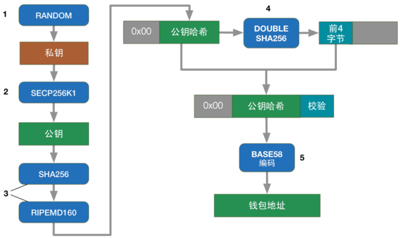
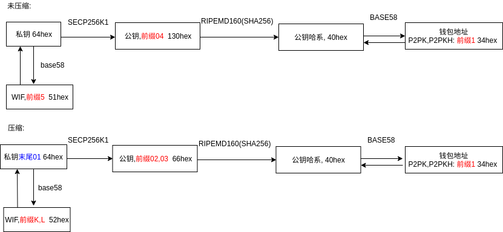

<!-- TOC -->

- [1. 说明](#1-说明)
- [2. 参考资料](#2-参考资料)

<!-- /TOC -->

<a id="markdown-1-说明" name="1-说明"></a>
# 1. 说明

比特币的转账是基于密码学的,借助于`unspent transaction output (UTXO)`(未花费输出),`Secp256k1 with ECDSA`(椭圆曲线数字签名)等技术,完成了货币的支付职能.类比于传统中心化系统的`帐号,密码,账户+密码验证->转账`,在比特币中变成了`公钥,私钥,私钥签名+公钥认证->转账`.本文简单讲述一下,私钥,公钥,公钥哈系,钱包地址之间的关系,并提供shell指令以供方便使用.

关系:  


流程图:  


(以上图片截取自互联网)

由于椭圆曲线生成的公钥可以被压缩,所以如下图我们按照两个线路来梳理私钥,公钥,公钥哈希,钱包地址的关系.




安装libbitcoin-explorer
```bash
wget https://github.com/libbitcoin/libbitcoin-explorer/releases/download/v3.2.0/bx-linux-x64-qrcode
sudo mv bx-linux-x64-qrcode /usr/local/bin/bx
chmod +x /usr/local/bin/bx
```

公钥未压缩:
```bash
PRIKEY=`bx seed | bx ec-new`
PRIKEYWIF=`bx ec-to-wif -u $PRIKEY`
PUBKEY=`bx wif-to-public $PRIKEYWIF`
PUBKEYHASH=`bx sha256 $PUBKEY | bx ripemd160`
ADDRESS=`bx ec-to-address $PUBKEY`
URL=`bx uri-encode $ADDRESS`
QRCODE=`bx qrcode -p $ADDRESS`
echo 私钥: $PRIKEY &&
echo 私钥WIF: $PRIKEYWIF &&
echo 公钥: $PUBKEY  &&
echo 公钥hash: $PUBKEYHASH  &&
echo 地址: $ADDRESS &&
echo URL: $URL

# 生成二维码
echo $QRCODE > /tmp/1.png
```

公钥压缩:
```bash
PRIKEY=`bx seed | bx ec-new`
PRIKEYWIF=`bx ec-to-wif $PRIKEY`
PUBKEY=`bx wif-to-public $PRIKEYWIF`
PUBKEYHASH=`bx sha256 $PUBKEY | bx ripemd160`
ADDRESS=`bx ec-to-address $PUBKEY`
URL=`bx uri-encode $ADDRESS`
QRCODE=`bx qrcode -p $ADDRESS`
echo 私钥: $PRIKEY &&
echo 私钥WIF: $PRIKEYWIF &&
echo 公钥: $PUBKEY  &&
echo 公钥hash: $PUBKEYHASH &&
echo 地址: $ADDRESS &&
echo URL: $URL

# 生成二维码
echo $QRCODE > /tmp/1.png
```

<a id="markdown-2-参考资料" name="2-参考资料"></a>
# 2. 参考资料

* https://www.bitaddress.org/ (地址生成)
* https://en.bitcoin.it/wiki/List_of_address_prefixes (prefix)
* https://github.com/libbitcoin/libbitcoin-explorer (libbitcoin-explorer)
* https://github.com/libbitcoin/libbitcoin-explorer/wiki/Wallet-Commands (libbitcoin-explorer command)
* http://book.8btc.com/books/6/masterbitcoin2cn/_book/ch04.html (精通比特币第四章)
