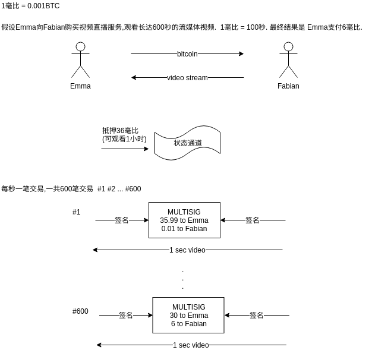
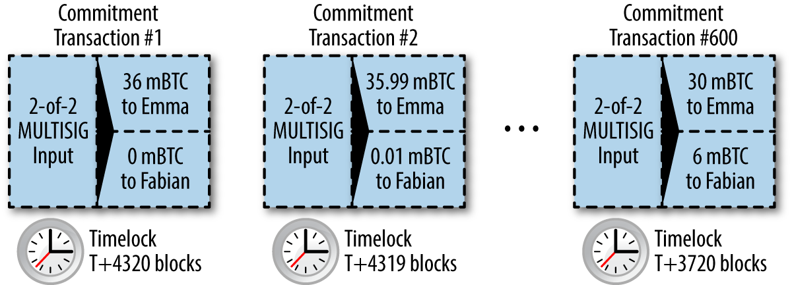

<!-- TOC -->

- [1. 应用](#1-应用)
- [2. 染色币 Colored Coins](#2-染色币-colored-coins)
- [3. 合约币 Counterparty](#3-合约币-counterparty)
- [4. 状态通道 支付通道](#4-状态通道-支付通道)
    - [4.1. 不对称可撤销承诺](#41-不对称可撤销承诺)
- [5. HTLC 哈系时间锁合约](#5-htlc-哈系时间锁合约)
- [6. 闪电网络](#6-闪电网络)

<!-- /TOC -->

# 1. 应用

* Proof-of-Existence (Digital Notary) 数字公证 `不可篡改性` + `时间戳` + `永久性`. 在指定时间是存在的,不能在事后修改,永久存储
* Kickstarter (Lighthouse) `一致性` + `原子性` + `可信`. 如果发起一个众筹活动,别人可以参加众筹,但是在目标完成之前,这笔钱不能被花费出去
* Payment Channels 控制法定人数 + 时间锁 + 杜绝双重支付 + 永不过期 + 耐审查 + 授权. 

# 2. 染色币 Colored Coins

利用比特币交易来记录除比特币之外的`外部资产的创建,所有权和转让`的技术.
* 代表无形资产: `如股票证书,许可证,虚拟财产(游戏装备)或大多数任何形式的许可知识产权(商标,版权)`
* 代表有形资产: 商品(黄金,白银,石油),土地所有权,汽车,船只,飞机等所有权

染色币的最新实施使用OP_RETURN脚本操作码将交易中的元数据与资产相关联的外部数据存储结合在一起.

两个最突出的实现是:
* Open Assets https://www.coinprism.info/
* Colu http://coloredcoins.org/explorer/

使用染色币创建并发行了MasterBTC资产. 代表了书的兑换券,这些兑换券可以使用染色币兼容的钱包进行转让,交易和兑换.

使用blockchain.info无法解码输出该地址  
https://www.blockchain.com/btc/tx/10d7c4e022f35288779be6713471151ede967caaa39eecd35296aa36d9c109ec

# 3. 合约币 Counterparty

与染色币类似的合约币协议提供了创建和交易虚拟资产和代币的能力.提供了去中心化的资产交换

使用`OP_RETURN操作码`或`1-N多重签名`的公钥地址将元数据嵌入到比特币交易中,该地址用于代替公共密钥进行元数据编码.

Tokenly是一个建立在合约币之上的平台,允许内容创作者,艺术家和公司发行数字所有权的代币,并可用于租凭据.

* https://counterparty.io/
* https://github.com/CounterpartyXCP

# 4. 状态通道 支付通道

通道一词是一个比喻,状态通道是区块连外,由`双方之间的交换状态代表的虚拟结构`.表示链外双方之间的关系和共享状态. 就好像TCP流只是IP数据包之上的虚拟通道

假设观看视频的业务使用状态通道

如上图: 作恶的方式:
* Emma需要Fabian的签名才能获得给自己的找零.如果Fabian消失,那么通道的钱就回不去了.
* 在通道正在运行时,Emma可以采取Fabian已经签署的任何承诺交易.并将它发回链上.只支付1秒的钱却看了600秒的视频.

使用时间锁(timelocks)可以解决上面的问题.

* 钱可以在锁定时间后找回
* 最新完成的交易可以最先广播到主链,防止其中任何一方的诈骗

问题是:

* 退款时间太长
* 通道参与者带来了非常高的负担,参与者必须保持警惕,随时准备广播正确的签名交易

## 4.1. 不对称可撤销承诺

构建一个没有时间锁代表相同余额的结算交易.

# 5. HTLC 哈系时间锁合约

# 6. 闪电网络

