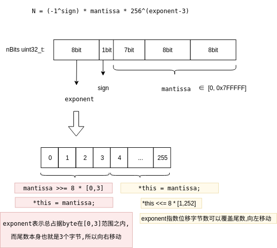
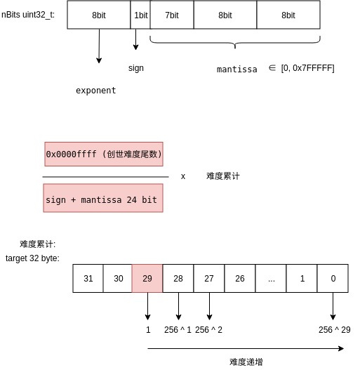

<!-- TOC -->

- [1. 难度调整](#1-难度调整)
    - [1.1. CMainParams (主网)](#11-cmainparams-主网)
    - [1.2. CTestNetParams(测试网络)](#12-ctestnetparams测试网络)
    - [1.3. CRegTestParams(本地测试网络)](#13-cregtestparams本地测试网络)
- [2. 主网难度取值](#2-主网难度取值)
- [3. nBits与target的转换](#3-nbits与target的转换)
    - [3.1. SetCompact](#31-setcompact)
    - [3.2. GetCompact](#32-getcompact)
- [4. difficulty](#4-difficulty)
- [5. hash rate](#5-hash-rate)

<!-- /TOC -->


<a id="markdown-1-难度调整" name="1-难度调整"></a>
# 1. 难度调整

```bash
# 源码
generate -> generateBlocks -> BlockAssembler::CreateNewBlock 

pblock->nBits          = GetNextWorkRequired(pindexPrev, pblock, chainparams.GetConsensus());
```
    
<a id="markdown-11-cmainparams-主网" name="11-cmainparams-主网"></a>
## 1.1. CMainParams (主网)


```bash
难度公式:
新的难度 = 旧的难度 * (过去2016区块的时间 / 两周时间)

限制1: 
过去2016区块的时间会调整为[两周时间/4,两周时间*4]之内,也就是难度会限制在增长/减少4倍之内

限制2:
难度不会低于设置的最小难度值
```


<a id="markdown-12-ctestnetparams测试网络" name="12-ctestnetparams测试网络"></a>
## 1.2. CTestNetParams(测试网络)


```
情况1:
当前生成区块与上一区块的时间间隔超过20分钟,则难度取为设置的最小难度值

情况2:
当生成区块与上一区块的时间间隔不超过20分钟时,恢复难度
```

<a id="markdown-13-cregtestparams本地测试网络" name="13-cregtestparams本地测试网络"></a>
## 1.3. CRegTestParams(本地测试网络)


```
情况1与情况2和上述相同
```


<a id="markdown-2-主网难度取值" name="2-主网难度取值"></a>
# 2. 主网难度取值

```bash
# 最小难度值
target: "00000000ffffffffffffffffffffffffffffffffffffffffffffffffffffffff"

# 创世区块难度值(比最小难度值大一些)
nBits: 0x1d00ffff
target: "00000000FFFF0000000000000000000000000000000000000000000000000000"
```


<a id="markdown-3-nbits与target的转换" name="3-nbits与target的转换"></a>
# 3. nBits与target的转换

```bash
# 源码

# nBits => target
arith_uint256::SetCompact

# target => nBits
arith_uint256::GetCompact
```


<a id="markdown-31-setcompact" name="31-setcompact"></a>
## 3.1. SetCompact




含义:
```
将uint32_t nBits 以浮点数的方式表示成"uint256_t" target

公式:
N = (-1^sign) * mantissa * 256^(exponent-3)

* 8bit exponent, 指数
* 1bit sign, 正负符号位
* 23bit mantissa, 尾数
```

256^(exponent-3)含义:
```
256变成二进制是1 00000000,表示向左移动(exponent-3)个byte

代码中是*this <<= 8 * (exponent - 3); 含义:
表示向左移动(exponent - 3)个byte

例如向左移动3个字节, 其含义是一致的:
256 ^ 3 = 16777216
1 << 8 * 3 = 256 ^ 3 = 16777216
```

为什么是256^(exponent-3),而不是256^(exponent),-3表达了什么?
```
移动到的最终值是uint256_t = 64hex = 32byte, 而尾数mantissa表达的范围是6hex,也就是3byte.

假设场景:
尾数mantissa=0x7fffff,指数exponent=5,那么*this <<= 8 * (exponent - 3);得到的结果是:

0x7fffff * 256^2 = 0x7fffff+2字节的0 = 0x7fffff + 0000, 其hex数值一共占据了5个字节. 

通过上面的场景的推断,可以明白exponent表示总体占据的字节数,包括了3byte的mantissa本身,所以左移时要-3.
```

指数最大可以取值多少?
```
256bit = 64hex = 32byte, 最大可以取值32byte
```

负数和溢出的判断
```bash
# pfNegative == true,需要同时满足以下条件,表示为负数
mantissa != 0 && (nBits & 0x00800000) != 0

含义是: 1. 尾数有值 2. 符号位是1 ,表示负数

# pfOverflow == true,需要同时满足以下条件,表示溢出
mantissa != 0 && ((exponent > 34) ||   // mantissa <= 0xff, 最大长度 = 32 + 2 = 34
(mantissa > 0xff && exponent > 33) ||   // 0xff < mantissa && <= 0xffff, 最大长度 = 32 + 1 = 33
(mantissa > 0xffff && exponent > 32));  // mantissa > 0xffff, 最大长度 = 32

含义是:
尾数 <= 0xff, 可以往左移动(34 - 3), 31 + 1 = 32字节
0xff < 尾数 <= 0xffff, 可以往左移动(33 - 3), 30 + 2 = 32字节
0xffff < 尾数 , 可以往左移动32 字节
```

nBits与难度值的关系
```
关键是指数exponent决定的:

指数越大,target越大,难度越小
指数越小,target越小,难度越小

而尾数只占据了[1,3]个字节,没有起决定作用
```

python实现
```python
def nbits2target(nBits):
	
	exponent = nBits >> 24
	
	mantissa = nBits & 0x007fffff
	
	rtn = 0
	
	if (exponent <= 3):
		mantissa = mantissa >> (8 * (3 - exponent))
		rtn = mantissa
	else:
		rtn = mantissa
		rtn = rtn << (8 * (exponent - 3))
		
	pfNegative = mantissa != 0 and (nBits & 0x00800000) != 0
	
	pfOverflow = mantissa != 0 and ((exponent > 34) or
            (mantissa > 0xff and exponent > 33) or
            (mantissa > 0xffff and exponent > 32))
	
	return rtn
	

def main():
	target = nbits2target(0x1d00ffff)
	
	target_str = '%x' % target
	target_str = "0x" +  "0" * (64 - len(target_str)) + target_str
	print("%s" % target_str)
	
	
if __name__ == "__main__":
	
	main()
```


<a id="markdown-32-getcompact" name="32-getcompact"></a>
## 3.2. GetCompact

含义

```bash
将uin256_t的target返回到uint32_t的nBits
```


python实现

https://github.com/daraosn/blockexplorer/blob/master/bin/getcompact.py

```python
import struct
import sys

def tompi(n):
        if n == 0:
                return struct.pack(">I", 0)
        r = ""
        neg_flag = bool(n < 0)
        n = abs(n)
        while n:
                r = chr(n & 0xFF) + r
                n >>= 8
        if ord(r[0]) & 0x80:
                r = chr(0) + r
        if neg_flag:
                r = chr(ord(r[0]) | 0x80) + r[1:]
        datasize = len(r)
        return struct.pack(">I", datasize) + r

def ntarget2bits(n):
        mpi = tompi(n)
        exponent = len(mpi) - 4
        nBits = (exponent & 0xFF) << 24
        if exponent >= 1:
                nBits |= (ord(mpi[4]) << 16)
        if exponent >= 2:
                nBits |= (ord(mpi[5]) << 8)
        if exponent >= 3:
                nBits |= (ord(mpi[6]) << 0)
        return nBits

print ntarget2bits(0x00000000FFFF0000000000000000000000000000000000000000000000000000)

```


<a id="markdown-4-difficulty" name="4-difficulty"></a>
# 4. difficulty

```bash
# 源码

# nBits => diffculty
GetDifficulty

# diffculty => nBits
未实现
```



```
难度累计的算法:

以创世难度为起点(尾数0x00ffff左移动29)  (浮点数)

* 尾数向右扩散(难度增加1字节,难度就乘以256)
* 尾数向左扩散(难度减少1字节,难度见除以256)

创世区块的难度为: 0x0000ffff / 0x00ffff =  1
```

python实现
```python
def getdiffculty(nBits):
	
	exponent = (nBits >> 24) & 0xff
	
	# ddiff = 0x0000ffff / (nBits & 0x0000ffffff)
	
	ddiff = 65535.0 / (1.0 * (nBits & 0x0000ffffff))
	
	while (exponent < 29):
		ddiff *= 256.0
		exponent += 1
	
	while (exponent > 29):
		ddiff /= 256.0
		exponent -= 1
		
	return ddiff
	

def main():
	
	ddiff = getdiffculty(0x1d00ffff)
	print("%s => %d" % ("0x1d00ffff", ddiff))
	
	# 551557 height
	ddiff = getdiffculty(0x172a4e2f)
	print("%s => %d" % ("0x172a4e2f", ddiff))
	

if __name__ == "__main__":
	main()
```


<a id="markdown-5-hash-rate" name="5-hash-rate"></a>
# 5. hash rate

