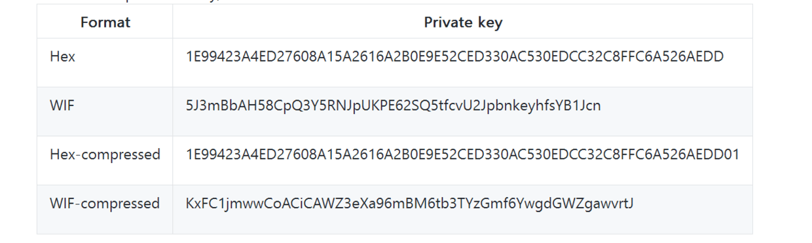
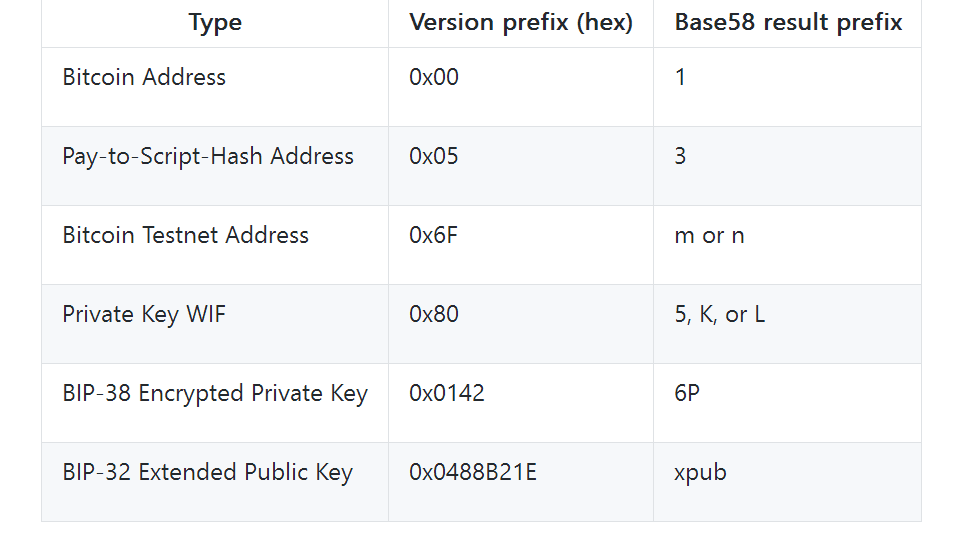

<!-- TOC -->

- [1. 资源](#1-资源)
- [2. 比特币的根本技术](#2-比特币的根本技术)
- [3. 比特币私钥,公钥,公钥哈希,钱包维度简单梳理](#3-比特币私钥公钥公钥哈希钱包维度简单梳理)
- [4. 比特币地址梳理](#4-比特币地址梳理)
- [5. 比特币交易速度每秒7笔](#5-比特币交易速度每秒7笔)

<!-- /TOC -->

<a id="markdown-1-资源" name="1-资源"></a>
# 1. 资源
* https://www.blockchain.com/zh-cn/explorer (比特币区块链浏览器)

---

* https://github.com/liuchengxu/blockchain-tutorial/blob/master/content/SUMMARY.md (很好的中文资料)
* https://www.zhihu.com/question/27687960/answer/148814714 (知乎资料索引)
* https://github.com/chaozh/awesome-blockchain-cn (所有资料)
* https://bbs.huaweicloud.com/community/usersnew/id_1518334573351109 (讲比特币的专栏)
* http://book.8btc.com/books/6/masterbitcoin2cn/_book/ (精通比特币书)

<a id="markdown-2-比特币的根本技术" name="2-比特币的根本技术"></a>
# 2. 比特币的根本技术


* `POW` 工作量证明的共识达成机制是Adma在Hashcash里提出来的
* 将`全部交易计入一本总账`,并给交易打时间戳来`防范双花攻击`(double-spend attack)的思想是的 b-money 和 Nick Szabo 的 Bitgold 提出来的
* P2P技术比不上2001年出现的BitTorrent

中本聪自创的
* 区块链的设计 + UTXO `Unspent Transaction Output`


<a id="markdown-3-比特币私钥公钥公钥哈希钱包维度简单梳理" name="3-比特币私钥公钥公钥哈希钱包维度简单梳理"></a>
# 3. 比特币私钥,公钥,公钥哈希,钱包维度简单梳理

* https://blog.csdn.net/jeason29/article/details/51576659 


<a id="markdown-4-比特币地址梳理" name="4-比特币地址梳理"></a>
# 4. 比特币地址梳理

类型|方式|hex长度|byte长度
-|-|-|-
privateKeyBytes|ecdsa.GenerateKey|64|32
publicKeyBytes|ecdsa.GenerateKey|128|64
publicKeyHash|SHA256+RIPEMD160|40|20
walletAddress|Base58Encode|`34`|17
signature|ecdsa.Sign(私钥,hash(证书))|128|64
txId|SHA256|64|32

私钥的存储格式:


公钥的存储格式:
* 未压缩格式: 04作为前缀,payload 128 hex, 一共130hex
* 压缩格式: 02或03作为前缀,payload 64 hex, 一共66hex

所有的钱包版本  



<a id="markdown-5-比特币交易速度每秒7笔" name="5-比特币交易速度每秒7笔"></a>
# 5. 比特币交易速度每秒7笔

* https://www.zhihu.com/question/41004649
* https://www.zhihu.com/question/41004649/answer/145731141

---
* 定义每一个区块的一个账册的大小是1MiB
* 每10分钟产生一个这样的区块
* 每个最基本的比特交易的大小是250B

```
1MiB = 1024 * 1024 B = 1048576 B

1048576 / 250 = 4194 (个)  -- 一个区块可有4194个比特币的转账记录

4194 / 600 ≈ 7 (个/s) -- 大约7秒钟能交易一个比特币
```

